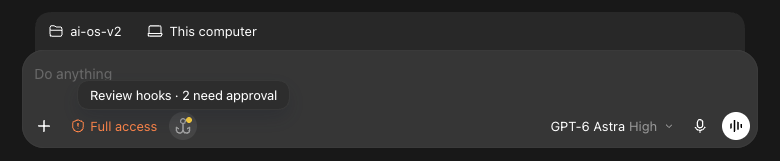
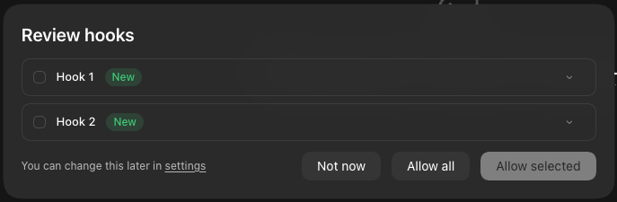
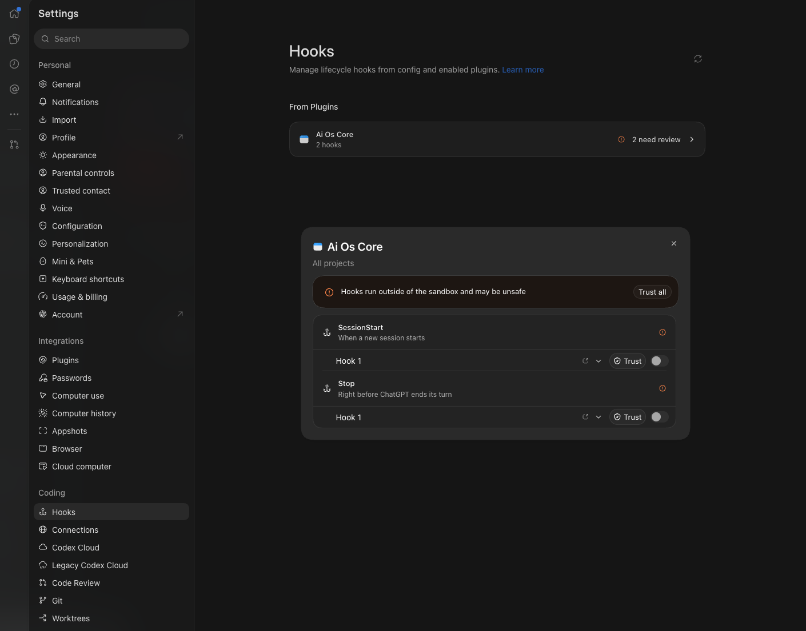
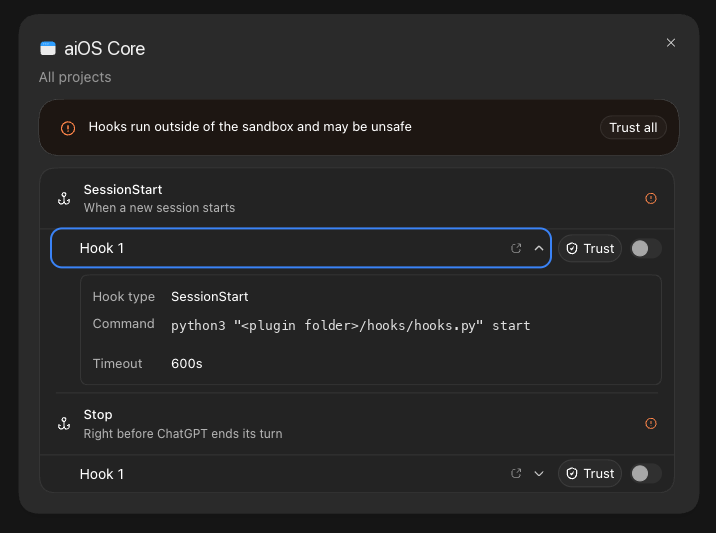
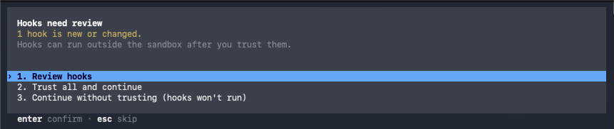
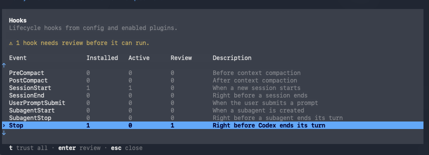
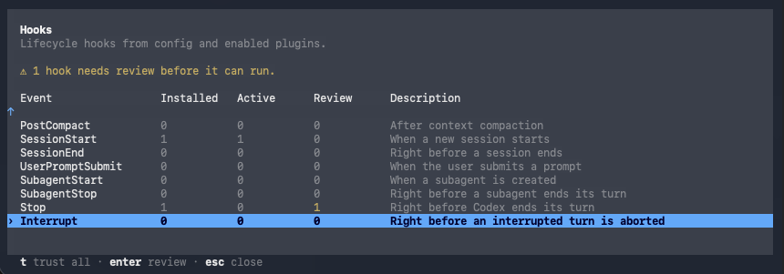

# Install and enable aiOS checks

Install aios-core, enable checks for a folder, and verify that hooks run.

Before you start, you need Claude Code or Codex installed, and Python 3.9 or later. Run `python3 --version` to check Python.
For local development, use the product repo's absolute path as the marketplace source.

## 1. Install the plugin

Claude Code:

```bash
claude plugin marketplace add MYRS-ai/aiOS
claude plugin install aios-core@aios --scope user
```

Codex:

```bash
codex plugin marketplace add MYRS-ai/aiOS
codex plugin add aios-core@aios
```

## 2. Set up a folder

Start an agent session in the folder you want to become the aiOS root. Ask the agent in plain words, for example "Set up aiOS in this folder." The agent harness picks the matching skill. In Claude Code you can also type `/aios-core:setup`.
The agent asks about your areas of work, files, and preferences, then confirms workspace names before building.

Setup creates settings, a docs copy, root and workspace contracts, and `shared/`.
It adds `.aiOS/logs/` to `.gitignore`. Existing files are skipped and reported.
Re-running setup adds missing pieces. A folder with its own `.aiOS/config.yaml` is a separate aiOS root.
Parent checks skip nested aiOS roots.

The skill runs this script after confirming workspaces:

```bash
python3 "<core plugin>/skills/setup/scripts/setup.py" [folder] --workspace NAME="PURPOSE"
```

Repeat `--workspace` for each workspace. The folder defaults to the current folder.
`<core plugin>` means the installed `aios-core` folder. Claude Code keeps it in `~/.claude/plugins/cache/aios/aios-core/<version>/`, and Codex in `~/.codex/plugins/cache/aios/aios-core/<version>/`.
In a source checkout, it is `<product repo>/plugins/aios-core`.
Run the check and status skills from the aiOS root to verify setup.
If existing contracts were skipped, review their Contents for any new workspace links.

## 3. Approve the hooks (Codex only)

Codex skips plugin hooks until you approve them. Claude Code requires no hook approval.

### Codex app

A hooks badge appears next to the prompt box:



Click it, then choose **Allow all**:



Hooks are also under **Settings > Hooks**. Each hook shows the command it runs:





### Codex CLI

At startup, Codex asks you to review new hooks. Choose **Trust all and continue**:



`/hooks` shows each event. The **Review** column counts hooks still waiting. Press `t` to trust all:



Scroll down in the table to see every event:



### When approval expires

Codex asks again when a definition in `hooks/hooks.json` changes. Plugin version updates and script changes keep the approval, as tested from 0.2.0 to 0.2.1.

## 4. Verify the hooks

1. Start a new session in the folder.
2. Send a message and let the turn finish.
3. Invoke the `status` skill from the same folder, or run:

```bash
python3 "<core plugin>/skills/status/scripts/status.py"
```

The status report shows the docs copy version and whether it matches the installed plugin.
Each agent harness you have used should show its last hook run:

```text
claude-code hooks: last ran 2026-10-03T16:33:50-07:00
codex hooks: last ran 2026-10-03T16:50:12-07:00
```

"never ran here" means the log has no hook run for that agent harness. If you already used that agent harness here, check installation and hook approval.

## 5. Run a full check

Invoke the `check` skill from the aiOS root, or run:

```bash
python3 "<core plugin>/skills/check/scripts/check.py"
```

Resolve any reported problems. A successful check reports `Problems: 0`.
The check reads files; timestamps are filled in by hooks when a turn ends.

## 6. Update the plugin

Plugin updates are off by default for this marketplace. Update each agent harness that you use.

Claude Code:

```bash
claude plugin marketplace update aios
claude plugin update aios-core@aios
```

Codex:

```bash
codex plugin marketplace upgrade aios
codex plugin add aios-core@aios
```

The Codex marketplace command refreshes the catalog; the add command installs the plugin from that catalog.
Start a new session after updating. Approve changed hook definitions in Codex and run the status script again.
